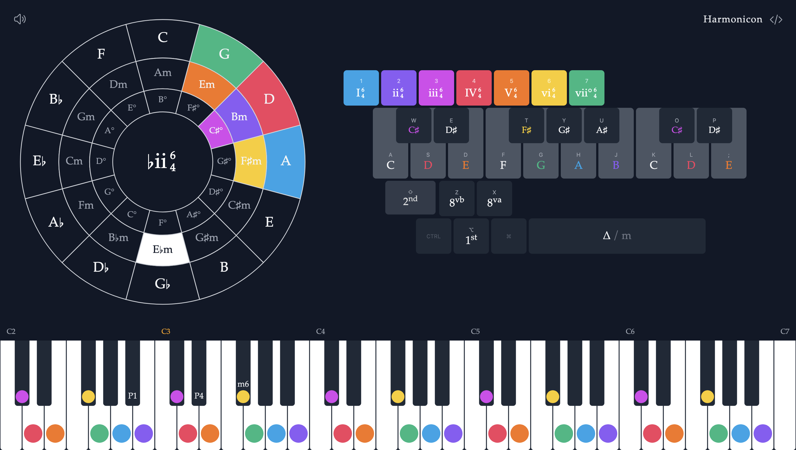

# Harmonicon



An interactive music theory tool for exploring the relationships between notes and chords. Inspired by the great educational material from [Hooktheory](https://www.hooktheory.com/) and [David Bennett Piano](https://www.youtube.com/@DavidBennettPiano). The idea is to provide a visually engaging way to see harmonic relationships, aiding memorization, playing by ear, and brainstorming song ideas.

## Usage

- **Play notes/chords**: Click and drag on the circle, keyboard, or piano
- **Chord inversions**: Hold Alt/Option for 1st inversion, Shift+Alt for 2nd inversion
- **Change key**: Right-click on the circle
- **Toggle major/minor**: Press Spacebar

## Development

```sh
bun install
bun run dev
```

## Limitations

- No mobile support (yet)
- Not tested on all keyboard layouts
